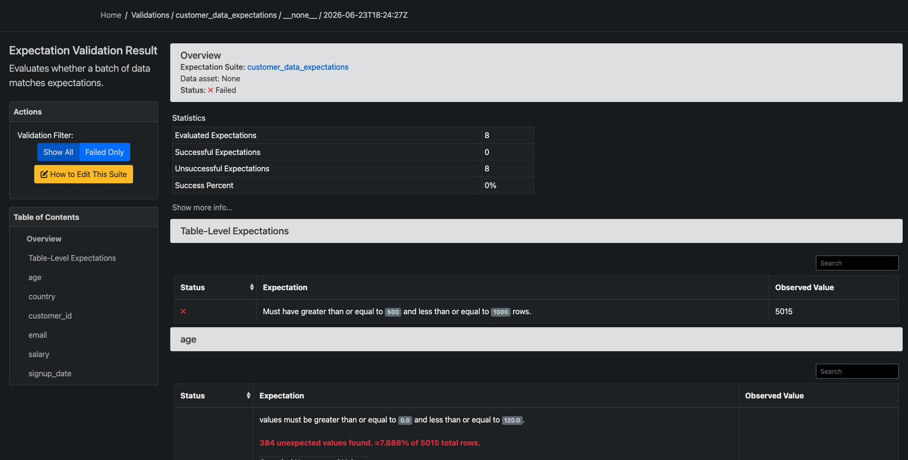
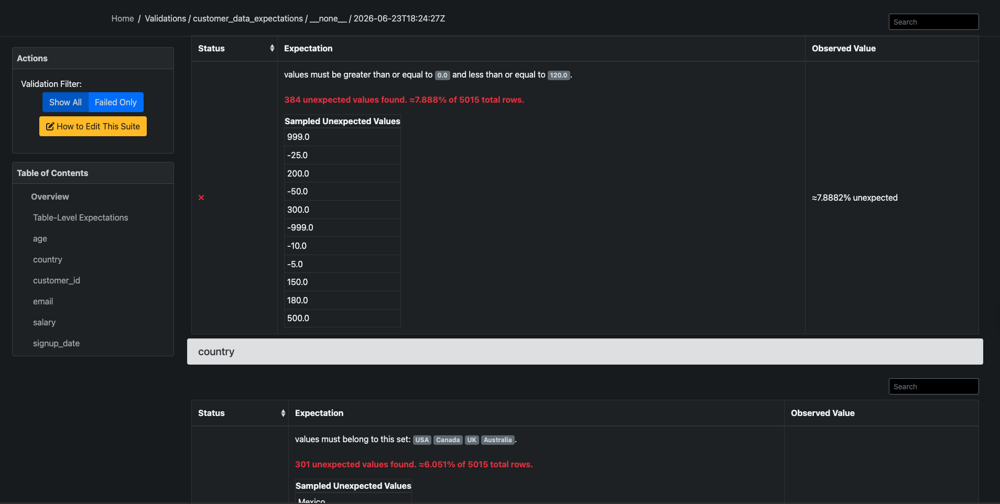
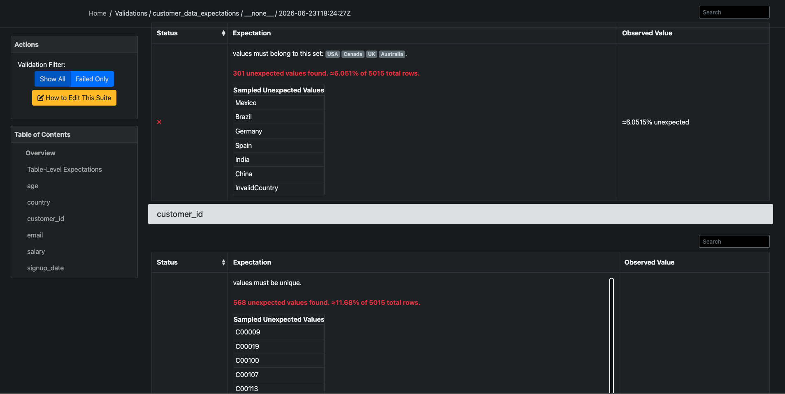
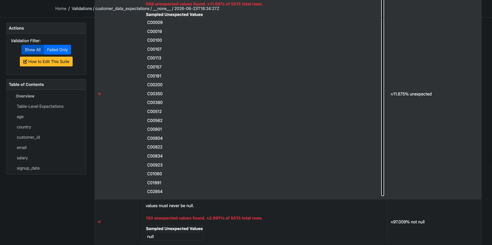
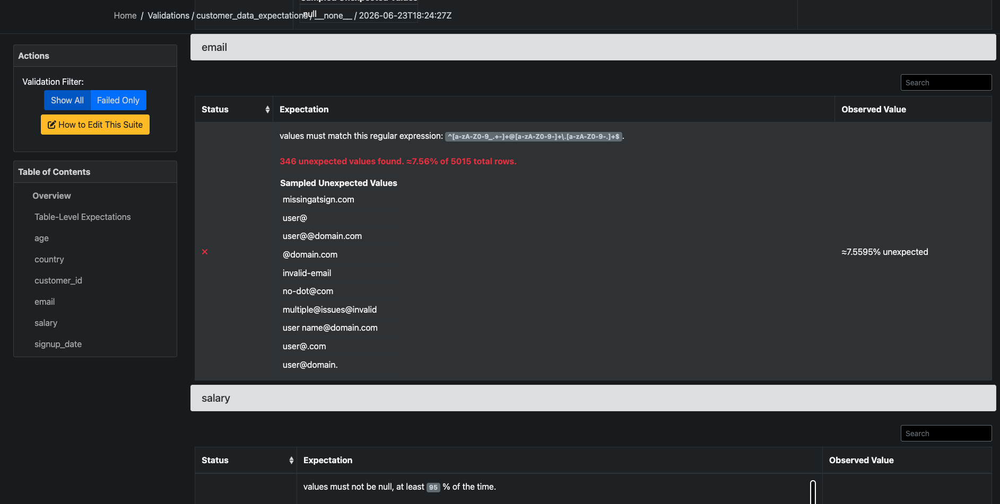
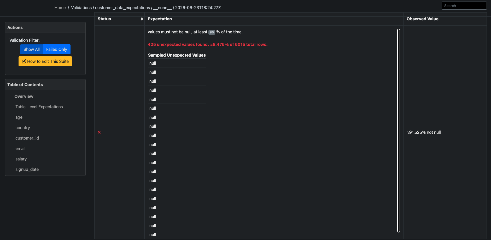
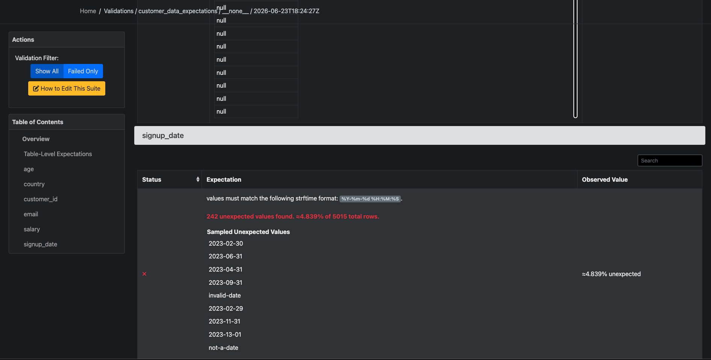
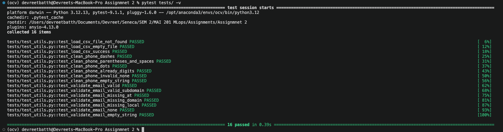

# Assignment 2 Report: Data Validation and Testing

**Name:** Devreet Kaur

**Course:** MAI201 MLOps

---

## Great Expectations Validation Results

The suite evaluated all eight required expectations against the provided `customer_data.csv` (5,015 rows, 7 columns). All eight failed, but each failure corresponds to a real, identifiable data quality issue rather than a configuration error. The full breakdown is in the table below.

**Note on expectation count:** the assignment list seven bullet points under "Create Expectations," but the first bullet point for `customer_id` asks for two separate rules: uniqueness and not-null. These are implemented as two separate Great Expectations checks, since they test different things, which brings the total to eight expectations. This matches the grading rubric, which specifically asks for "all eight expectations implemented correctly."

---
## Data Quality Issues Found

The real dataset has 5,015 rows. Here is what each check found.

| Issue | Where | How many | Out of 5,015 rows |
|---|---|---|---|
| Row count is way bigger than the assignment expected (500 to 1000) | whole table | 5,015 rows | not a percentage, just a size mismatch |
| Ages that make no sense (like 999 or -999) | age column | 384 | 7.89% |
| Countries not in the allowed list (like Mexico, Germany, or even the word "InvalidCountry") | country column | 301 | 6.05% |
| Same customer ID showing up more than once | customer_id column | 568 | 11.68% |
| Customer ID missing completely | customer_id column | 150 | 2.99% |
| Emails that are not real emails (missing @ sign, missing the part after @, etc.) | email column | 346 | 7.56% |
| Salary missing | salary column | 425 | 8.48% |
| Signup dates that do not make sense (like February 30th, which is not a real date) | signup_date column | 242 | 4.84% |

**A note on the row count:** the assignment's instructions say the table should have between 500 and 1000 rows. The real file given for this assignment has 5,015 rows. This is just a mismatch between the assignment's example numbers and the actual file size, not a mistake in the data itself. The check is included exactly as the assignment asked for it, and it correctly flags the difference.

**A bit more detail on a few of these:**

- The bad ages included values like 999, -999, -25, and 500, numbers no real person's age could be.
- The bad countries included real countries that just were not on the approved list, plus one row that literally said "InvalidCountry."
- The duplicate customer IDs mean the same ID number shows up two or more times in the file, as if the same person was entered twice.
- The bad emails were missing pieces, like no @ sign at all, two @ signs, nothing after the @ sign, or a dot with nothing after it.
- The missing salary values mean about 8 to 9 percent of rows have no salary number at all.
- The bad signup dates included dates that do not exist on a calendar, like June 31st, plus a few rows that just said "not-a-date."

---

## pytest Results

This screenshot shows all the small code tests passing.

All 16 tests passed. These tests cover three functions: one that loads a CSV file, one that cleans up messy phone numbers, and one that checks if an email looks valid. Each function was tested with good input, bad input, and tricky edge cases like empty files or missing values, to make sure it behaves correctly no matter what gets thrown at it.

---

## Reflection

Out of everything found, the duplicate customer ID problem would hurt a machine learning model the most. It is also the biggest issue by percentage, at almost 12 percent of all rows.

The reason this matters so much is that almost everything in machine learning assumes each row represents one separate, distinct customer. If the same customer shows up multiple times, a model ends up paying extra attention to that customer without anyone meaning for that to happen. Worse, if one copy of that customer ends up in the training data and another nearly identical copy ends up in the testing data, the model can look like it is performing really well during testing, simply because it already saw a near-twin of that exact customer during training. That makes the model's reported accuracy misleading, since it would not actually perform that well on totally new customers it has never seen before.

Compare that to something like a missing country value. That is an easy fix, you can just label it "unknown" and move on, no real harm done. Duplicate customer records do not have a quick fix like that. Someone has to actually decide which copy of the record is the real one to keep, and that decision needs to happen before any model training starts, not something the model can just work around on its own.